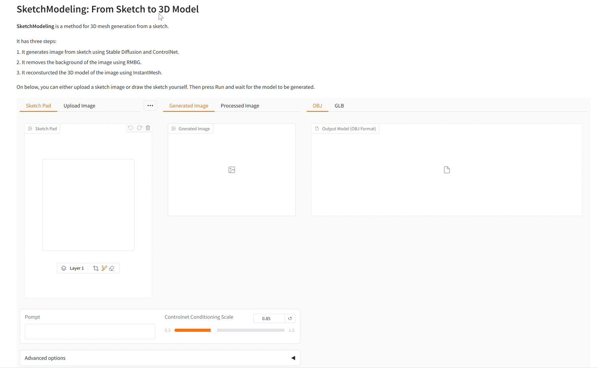
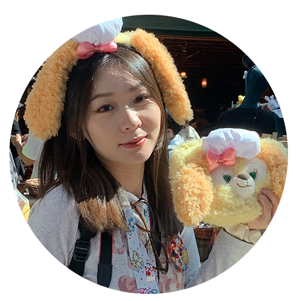

# SketchModeling: From Sketch to 3D Model

**SketchModeling** is a method for 3D mesh generation from a sketch.

## Get Started
This is an example of how you may give instructions on setting up your project locally. To get a local copy up and running follow these simple example steps.

### Prerequisites


### Install Dependencies
- Recommend using: python=3.12 + cuda=12.4
- Install CUDA of your computer’s support version. In my case, I downloaded CUDA 12.4 through this [link](https://developer.nvidia.com/cuda-12-4-0-download-archive) (**NOT THROUGH CONDA**)
- if you have problem installing CUDA, try installing Nsight separatly, then installing CUDA in advanced mode and uncheck Nsight.
- Install the right version of [pytorch](https://pytorch.org/) and [xformers](https://github.com/facebookresearch/xformers)
- Install the remaining requirements with `pip install -r requirements.txt`

## Usage

## Contributing

### Top contributors:

<div style="display: flex; justify-content: space-between;">
  
  
  
</div>

## License

## Contact
Zhang Jiaqi marycheung021213@gmail.com
Zhou Shengnan 24058989g@connect.polyu.hk
Zeng Yihan zengyihan9@gmail.com

## Acknowledgments

### Load Gradio App
```sh
python app.py
```
